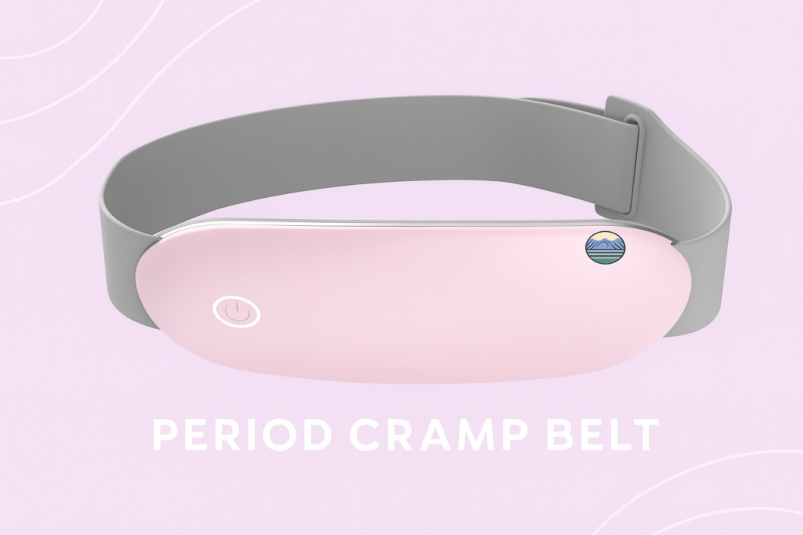

# Comfort Crew – Period Cramp Belt Website

Smart wearable web interface for Comfort Crew's period pain relief belt.  
This project combines minimal UI design with intuitive controls for heat and vibration settings in a wearable belt designed to relieve menstrual cramps.

## 🔧 Features

- Auto & Manual Heat Modes (custom temperature controls)
- Multiple Vibration Patterns with Descriptions
- Responsive UI with mobile-friendly layout
- Simple Sign Up / Sign In system
- San Francisco font aesthetic + sleek black theme
- Scroll-based header animation
- Fully HTML & CSS implemented with React version available

## 📷 Preview

## 📁 Tech Stack

- HTML / CSS (Vanilla Version)
- React (Component-based UI Version)
- JavaScript (interactive behavior)
- Tailwind CSS (in some versions)

## 📌 Project By

- **Vibhuti** – Lead Product Designer  
- **Bharat** – Hardware & Web Developer  
- **Keisha** – Brand Strategist  
